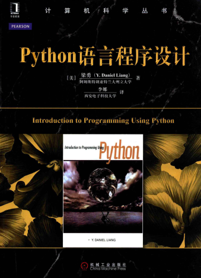

<h1 align="center">Do you want to be a Python expert ?</h1>

    

### Content:

  - [前言](./preface.md)
  - [data model class (dunder methods, protocol)](./data-model.md)
  - metaclass (Base/Derive class)
  - decorators
  - generators
  - context managers

### Python学习之路

**我的第一本Python书: Python语言程序设计, 作者:梁勇.**

对于其他的一些Python入门书,我多少都翻过,但我仍然推荐这本书.

*Why?* 这本书不薄,毕竟400页呢.而且这本书如果你没有编程的底子的话,还是挺难的.

- 首先,我们编程,为的是什么? 为的是解决问题,用代码去解决问题.(这本书就是)

- 更为重要的是,如果你想要走的长远,最重要的是培养计算思维.

这本书的课后练习题不少都挺难的, 当初我花了俩星期才把这本书+课后习题做完.
所以如果你过去写别的语言,现在想要学Python了,那就看这本书吧.来试试你能否
把课后习题都做出来.

这本书Python最好的第一本书了,如果你坚持看完,解决完课后习题,除了你学会了Python,
更重要的是,你的编程能力会得到很多提升.

[Python语言程序设计 pdf 下载](http://piffy1zbf.bkt.clouddn.com/Python%E8%AF%AD%E8%A8%80%E7%A8%8B%E5%BA%8F%E8%AE%BE%E8%AE%A1.pdf)

-------------------------------------------------------

**流畅的Python**: 相信学过Python的人都听说过这本书. 既然别人都推荐了.
那我也推荐呗, 不过这本书不推荐你上来就看,因为里面讲述了Python的方方面面.
是对Python的整体的讲解,让你形成一个知识体系.

我推荐至少读两遍,为什么要读两遍呢,因为第一遍的时候你会感觉好多地方读完之后,或者看不懂,
或者看完之后没几天就忘记了, 所以这第一遍,知道这本书都讲了哪些东西,然后等第二遍读的时候,
看到某某东西,不至于不知道是什么东西.第二遍要认认真真的读,能都记住最好.

[流畅的Python pdf 下载](http://piffy1zbf.bkt.clouddn.com/%E6%B5%81%E7%95%85%E7%9A%84Python.pdf)

### License

